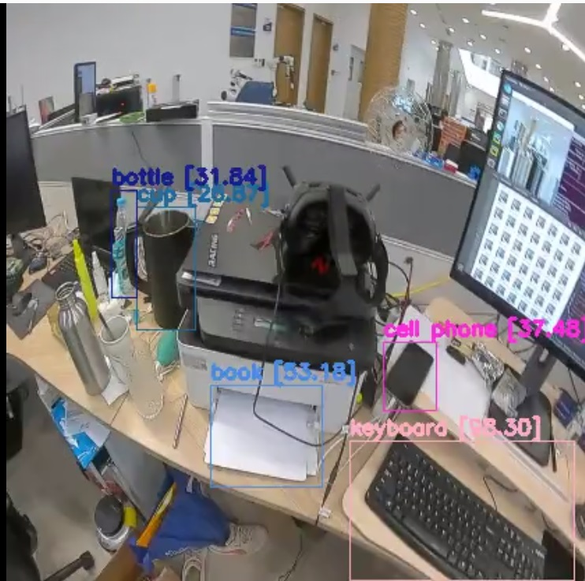

#FPV detector

This repo depends on: 

- https://github.com/hcardwell/usb-vsp
- https://github.com/xdr940/fpv-cv
- https://github.com/AlexeyAB/darknet

Darknet Yolo (AlexeyAB version) is added as post-process module for detection.

You may need:
- laptop with a N-card and usb3.0 port
- Ubuntu 16/18
- CUDA, Cudnn, OpenCV
- DJI FPV Googles V1 and Air Unit Module (AUM) and a long usb cable (tested device)

DJI FPV Combo with Googles V2 may work, but no devices for test.

#### How to install ###############
1. Install darknet follow: [Darknet](https://github.com/AlexeyAB/darknet)
2. Copy `libdarknet.so` to `./lib` (the file depends on your local hardware and cuda version)
3. `bash ./install/envs.sh` 
4. Use `pip` install python dependence, install whatever it needed.

#### How to use ###############

1. open a terminal and run:
    ```apex
    python stream.py
    ```

2. Plug in power for Googles and AUM
   
3. open another terminal and run:
    
    3.1 For simple video 
    ```apex
    python play.py
    ```
   3.2 For detector, generate some BBox on each frame
    ```apex
    python detect.py
    ```



#### Detector information
- The current detector is yolov4-tiny, for other models, you need copy related cfg and pre-trained weights files from darknet project to `./cfg`.
- For local model training, you further need to label your own dataset, and may also need a GPU server. And all the related files in `./cfg` need to replace.

#### Restart Hints ###############
1. Run stream.py before power on Googles (leave AUM keep running). Each time you restarted, unplug, wait 5s, and then plug the power for Googles.

2. Because my AUM is not on the fly, cooling is import.

3. To confirm the detector, use `python ./lib/darknet_images.py --input hourses.jpg`
#### Current problem
1. The video steam quality is terrible, and may lead to error detection results. Can ffmpeg fix this?
2. Not try on the Combo.
3. Calibrate camera.
